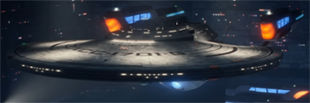
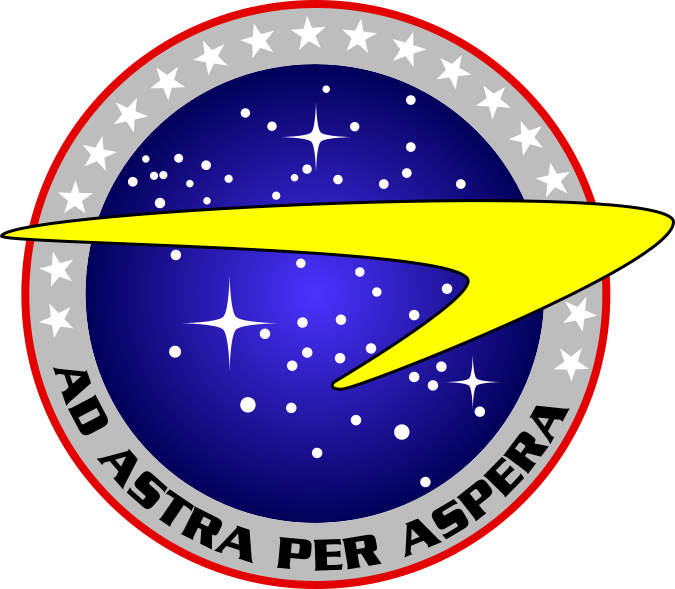

<div align="center">


# U.S.S. ENTERPRISE • NCC-1701-G
### STARFLEET COMMAND // DIVISION OF OPERATIONS & ADVANCED RESEARCH
**LCARS-2500 CONSOLE INTERFACE • SYSTEM DIRECTIVE 2402.1**


<p align="center">
  
  
  
  
  
</p>

</div>

---

<div align="center">
  
</div>

<div align="center">
  
</div>

```
========================================================================================
[LCARS TERMINAL 25.04.1] :: U.S.S. ENTERPRISE-G :: OPERATIONS & ADVANCED RESEARCH CORE
STARDATE: 103214.8      :: SECTOR: 001 (SOL)    :: ODN RELAYS: NOMINAL (99.98%)
DEFLECTOR: ENGAGED      :: SHIELDS: 100%        :: NEURAL ARRAYS: SYNCHRONIZED
========================================================================================
```

### 🖖 ACTIVE STARFLEET FLEET DEPLOYMENTS

| Mission Directive | Classification | Subsystem Status & Architecture |
| :--- | :--- | :--- |
| 🛸 **[Project Zora](https://github.com/BlahBlah23406/project-zora)** | `LOCAL-AI CORE` | Starfleet-themed personal assistant & dashboard inspired by Discovery's AI. Dual-LLM cognitive pipeline orchestrating local `DeepSeek-R1` (deep reasoning) & `Qwen 2.5` (JSON parsing) with continuous rule evolution. |
| 📡 **[Agent-Comms](https://github.com/BlahBlah23406/agent-comms)** | `SUBSPACE RELAY` | Production-grade protocol and toolkit enabling autonomous AI coding agents to communicate, transfer mental models, and synchronize workspace contexts across distributed sessions. |
| 🏙️ **[Agentropolis](https://github.com/BlahBlah23406/agentropolis)** | `SWARM DISPATCH` | AI agent orchestration visualized as a living metropolis: buildings operate as autonomous agents, payloads move as transport vehicles, and the operator commands as Governor. |
| 🛡️ **[Lockout Protocol Alpha](https://github.com/BlahBlah23406/lockout-protocol-alpha)** | `TACTICAL SHIELD` | Multi-platform accountability monitor for Android and macOS using computer vision to evaluate operational state against dynamic behavioral rulesets. |
| 📐 **[Project Asgard](https://github.com/BlahBlah23406/project-asgard)** | `GUIDANCE ARRAY` | Ground-up autonomous trajectory planning tool written in Kotlin/Java to generate, test, and export high-precision robot movement paths. |
| 🤖 **[Project Theta](https://github.com/BlahBlah23406/project-theta)** | `AVIONICS & DRIVE` | Precision odometric drive and autonomous control software engineered for competitive robotics systems. |

<div align="center">
  
</div>

### 🔬 PRIMARY SHIP SUBSYSTEMS (TECHNICAL ARSENAL)

```
┌── [01] NEURAL COMPUTE CORE ────────────────────────────────────────────────────────┐
│ • Local Models & SLMs : DeepSeek-R1 • Qwen 2.5 • Ollama Runtime                    │
│ • Cognitive Systems   : Dual-LLM Architectures • Multi-Tier Memory • Reflection    │
│ • Autonomous Agents   : Tool Calling • Prompt Decomposition • Nuance Recovery     │
└────────────────────────────────────────────────────────────────────────────────────┘
┌── [02] SUBSPACE TRANSMISSION & RUNTIME ────────────────────────────────────────────┐
│ • Languages & Stacks  : TypeScript • JavaScript • Python • Kotlin • Java           │
│ • Realtime Streams    : Server-Sent Events (SSE) • WebSockets • REST Endpoints     │
│ • Protocols           : Agent-Comms Inter-Session Context Exchange                │
└────────────────────────────────────────────────────────────────────────────────────┘
┌── [03] GUIDANCE, AVIONICS & SENSORS ───────────────────────────────────────────────┐
│ • Kinematics & Drive  : Odometric Tracking • Trajectory Generation • Motion Control│
│ • Vision & Analytics  : Vision-Language Model Analysis • Automated Surveillance    │
└────────────────────────────────────────────────────────────────────────────────────┘
```

<div align="center">
  
</div>

### 📊 SUBSPACE TELEMETRY & FLIGHT METRICS

<div align="center">


<br/><br/>


</div>

<div align="center">
  
</div>

<div align="center">
  
  <br/>
  <i>"Names mean almost everything. They're a promise of what is to come, and a reminder of what came before."</i>
  <br/>
  <b>— STARFLEET COMMAND ARCHIVES // COMMISSIONING DISPATCH NCC-1701-G</b>
</div>
